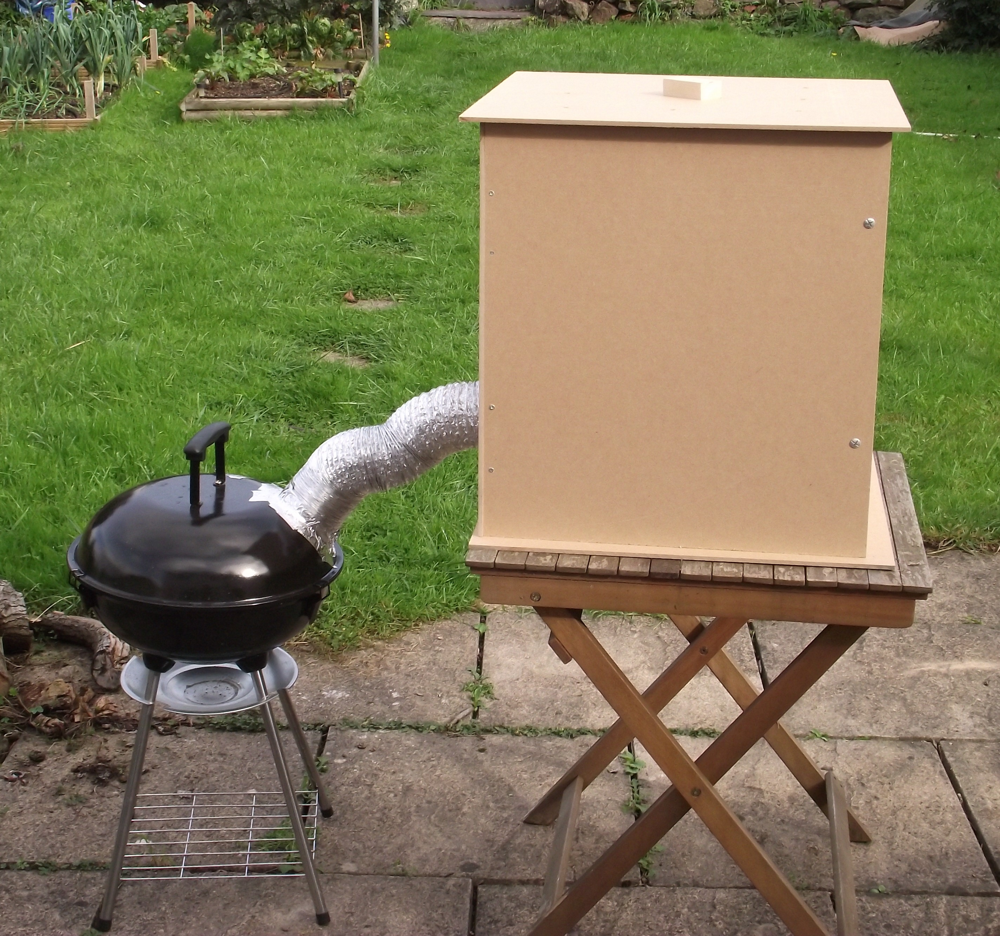

## Introduction

There are few things that you can turn your hacking skills to that can give you as much enjoyment as food. Most people eat around a thousand meals a year, so that’s a thousand chances to use your knowledge and skill to increase your happiness. To us, that sounds like a great area to focus on. We’ll start with a brilliant way of adding flavour to a wide range of foods such as meat, cheese, and fish: cold smoking. 

### Design

The three main things you need your smoker to do are produce smoke, cool the smoke, and apply the smoke to the food. None of these things is especially difficult, and the hardest thing for many DIY smokers is just getting them all into a limited amount of space. In most cases, this is done best by splitting the three tasks up into three separate physical parts.

The rough layout of our design is widely used for small-scale smokers. You have a firebox, which contains some smouldering wood that’s used to generate the smoke; there’s then some ducting that the smoke travels along, cooling as it goes. This duct deposits the smoke into a smoke chamber that holds whatever it is you want to smoke. 

