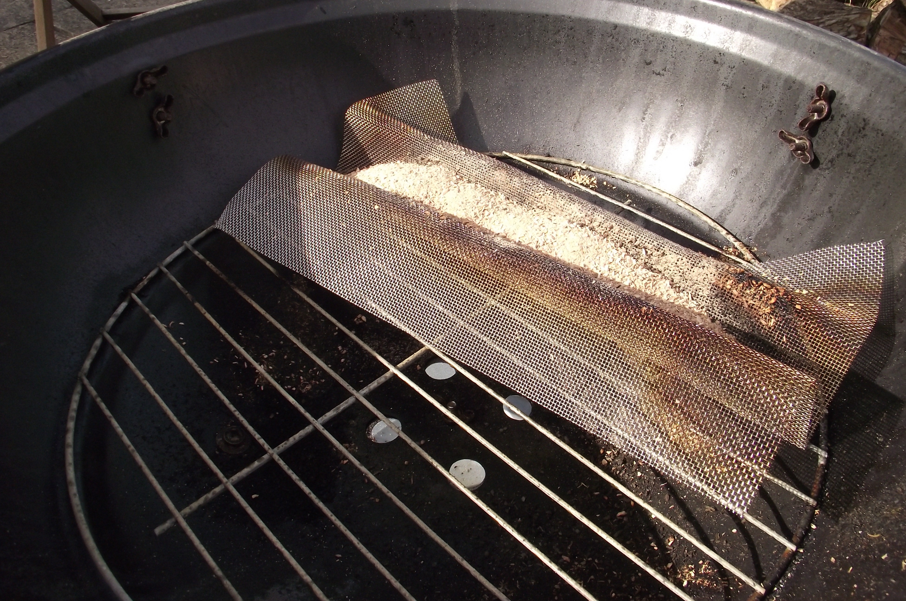

## Firebox

First, let’s take a look at the firebox. This obviously needs to be fireproof, it needs to be fairly well sealed (so the smoke doesn’t leak out everywhere), and it needs to connect to the ducting; but other than that, it can be almost anything that’s large enough. 

We’ve used a barbecue (because last year’s miserable summer in the UK led to lots of discounts at garden centres). Garden incinerator bins are a popular alternative, and almost anything metal that you can attach a duct to will work. The trick to producing smoke is to control the fire properly. If the wood burns too well, then you’ll get flames but not much smoke and you’ll burn through your wood quickly. If it burns too slowly, it’ll go out. There are maze smoke generators commercially available that are just tracks that allow wood to burn, but unlike hacked-together options, these don’t allow you to adjust the width of the burning sawdust, so it’s hard to control the amount of smoke. 

There are a few options for building your own smoke generator, but the easiest is to create a long, thin pile of sawdust that you light at one end so that it slowly burns along. How long this pile should be is defined by the length of time for which you want to generate smoke, and how thin it is depends on how much smoke you want. There aren’t any formulae for calculating this, as it also depends on the airflow of the smoker, the moisture content of the wood, and a myriad other factors. Essentially, getting the right dimensions comes down to trial and error. 

We’ve created our pack of sawdust using 1 mm wire mesh. You can buy this in sheets, and it’s easy to work with. Fold it into an M shape by hand, and pile the wood dust in the middle groove. We found that 1 mm mesh was fine enough to hold commercial cold-smoking wood dust, but we wouldn’t recommend anything with larger holes than this. Our 30 cm-long sheet of mesh burned for about four hours. If you need a longer burn time, you can either refill it or get a longer mesh. We found that we needed a pile of wood dust about an inch and a half (38 mm) deep and about the same width to sustain a smouldering fire, and two inches (51mm) deep provided a thicker smoke. 

To get smoke, just set fire to one end of this dust trail. A blowtorch is the easiest option, but a candle underneath also works (just remember to remove the candle before smoking the food). A cigarette lighter can work, but you’re likely to burn your fingers once or twice. 

We were able to saw a square hole in the metal lid of the BBQ with a hacksaw and attach the duct (see below) to the firebox using heat-resistant tape. It wasn’t the neatest join, but we found that this was a situation where a neat finish would have taken a lot of time for very little gain. It does, however, need to be fairly smokeproof, so you might need to pile on the tape — if anyone asks, tell them you were aiming for the rustic look. The bigger the hole you create, the better the smoke will flow through into the duct (provided you haven’t made it bigger than the duct, of course).

