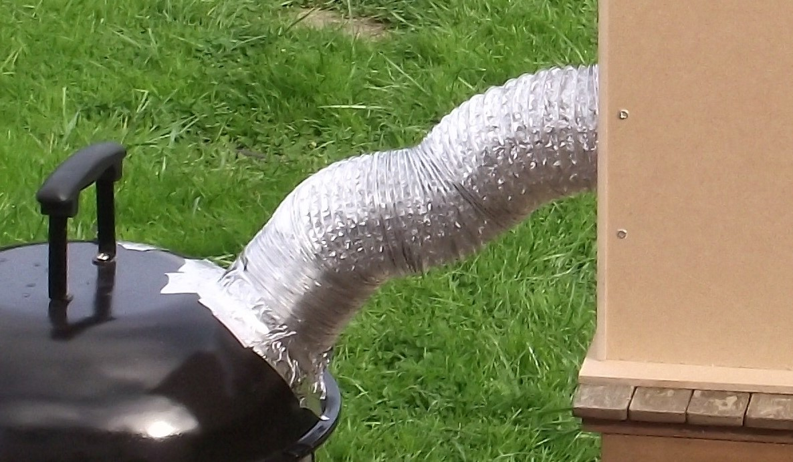

## Duct tales
You’ll be glad to know that the firebox is the most complex part of the build. Now we’ve dealt with that, everything gets easier. The duct just needs to be long enough for the smoke to cool down sufficiently. There aren’t any hard and fast rules on this, as it depends on your firebox design, the amount of heat produced by the smouldering wood, and the ambient temperature in the smoke chamber. The end result we’re looking for is a chamber under 26°C (79°F). As a general rule of thumb, we’d say around 1 to 1.5 metres should be fine, but we’ll use a thermometer to ensure that the smoke chamber is at the correct temperature when smoking. Provided that you control the burn in your firebox well, the duct shouldn’t get too hot, but it’s always best to err on the side of caution and make sure that it’s heat-proof. There are a few options here. A solid metal pipe can work, provided it has a large enough diameter to let the smoke flow freely, but it can be a little awkward to work with. Perhaps the easiest option is a flexible chimney liner. There are also other flexible high-temperature ducts available. Remember that plastics can give off toxic chemicals even if they’re not burning — we’d highly recommend staying away from anything non-metallic. We used metallic ducting designed for channelling smoke in oven hoods.

